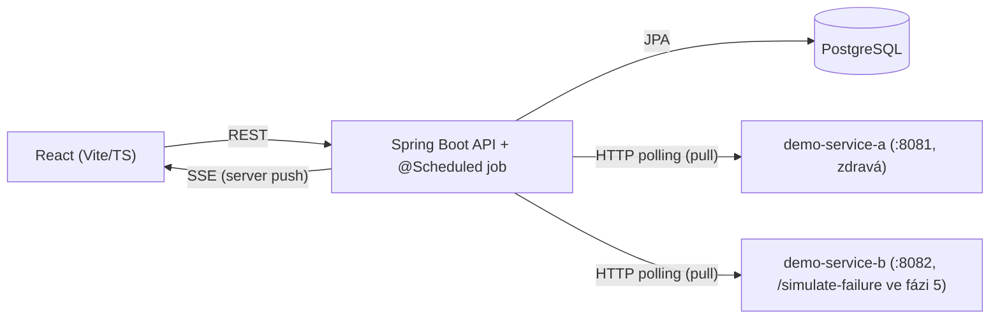

# Monitoring Dashboard

Simulovaný monitoring firemní infrastruktury: sleduje stav a metriky zaregistrovaných
služeb, vyhodnocuje alert pravidla a v reálném čase posouvá aktualizace na dashboard.
Portfolio projekt demonstrující full-stack Java/React vývoj.

## Architektura



Backend pravidelně (pull model, viz [docs/architecture.md](docs/architecture.md))
obchází monitorované služby přes skutečnou síť — v repu jsou pro demo účely dvě
samostatné "hloupé" Spring Boot služby (`demo-services/`), aby monitoring
testoval reálnou HTTP komunikaci, ne interní volání. Backend ukládá metriky do
PostgreSQL, vyhodnocuje alert pravidla a nové stavy posílá na frontend přes SSE.
Frontend zbytek dat (historie, konfigurace) tahá klasicky přes REST.

## Tech stack

- **Spring Boot 3 / Java 21** — standard pro backend v Java ekosystému, dobrá
  podpora pro REST, JPA i SSE (`SseEmitter`) bez extra závislostí.
- **Gradle** — rychlejší a čitelnější build config než Maven pro tuhle velikost projektu.
- **PostgreSQL** — relační DB, hodí se pro strukturovaná data (services, alerty)
  i time-series metriky v menším rozsahu.
- **Flyway** — verzované DB migrace, žádné "magic" schema z Hibernate `ddl-auto`.
- **Server-Sent Events (ne WebSocket)** — tok dat je jednosměrný (server → klient),
  SSE je jednodušší infrastruktura a běží nad běžným HTTP/HTTP2.
- **React 18 + TypeScript + Vite** — rychlý dev feedback loop, typová bezpečnost
  na frontendu.
- **Docker + docker-compose** — jednotné a reprodukovatelné lokální prostředí.

## Struktura projektu

Podrobný popis architektury a doménového modelu je v [docs/architecture.md](docs/architecture.md),
návrh REST/SSE API v [docs/api.md](docs/api.md). Stručně:

```
backend/         Spring Boot aplikace (REST API, SSE, scheduler, DB přístup)
demo-services/   dvě "hloupé" Spring Boot služby simulující monitorovanou infrastrukturu
frontend/        React + TypeScript dashboard
docs/            architektura, API design
```

## Lokální spuštění (placeholder)

> Plná implementace Docker/Compose setupu přijde ve Fázi 4. Zatím jde jen o skeleton.

```bash
cp .env.example .env
# doplnit DB_USER / DB_PASSWORD v .env
docker-compose up
```

Backend poběží na `:8080`, frontend na `:5173`, PostgreSQL na `:5432`,
`demo-service-a` na `:8081` a `demo-service-b` na `:8082`.

## Status

🚧 **Projekt je ve fázi scaffoldingu.** Existuje adresářová struktura, konfigurační
kostra a dokumentace — žádná business logika, REST endpointy ani UI komponenty
zatím implementované nejsou. Následují Fáze 2 (backend) a Fáze 3 (frontend).
