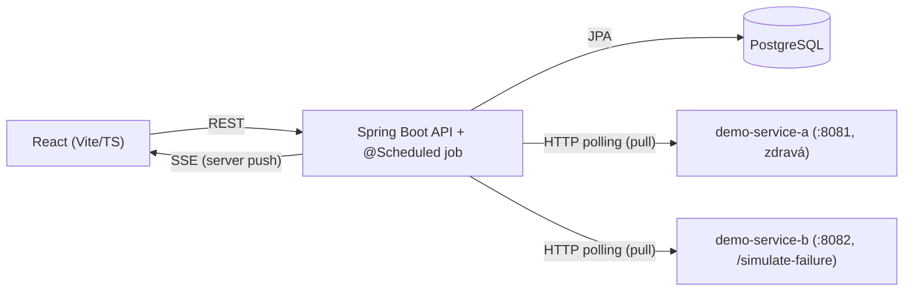

# Monitoring Dashboard

Simulovaný monitoring firemní infrastruktury: sleduje stav a metriky zaregistrovaných
služeb, vyhodnocuje alert pravidla a v reálném čase posouvá aktualizace na dashboard.
Portfolio projekt demonstrující full-stack Java/React vývoj.

## Architektura



Backend pravidelně (pull model, viz [docs/architecture.md](docs/architecture.md))
obchází monitorované služby přes skutečnou síť — v repu jsou pro demo účely dvě
samostatné "hloupé" Spring Boot služby (`demo-services/`), aby monitoring
testoval reálnou HTTP komunikaci, ne interní volání. Backend ukládá metriky do
PostgreSQL, vyhodnocuje alert pravidla a nové stavy posílá na frontend přes SSE.
Frontend zbytek dat (historie, konfigurace) tahá klasicky přes REST.

## Tech stack

- **Spring Boot 3 / Java 21** — standard pro backend v Java ekosystému, dobrá
  podpora pro REST, JPA i SSE (`SseEmitter`) bez extra závislostí.
- **Gradle** — rychlejší a čitelnější build config než Maven pro tuhle velikost projektu.
- **PostgreSQL** — relační DB, hodí se pro strukturovaná data (services, alerty)
  i time-series metriky v menším rozsahu.
- **Flyway** — verzované DB migrace, žádné "magic" schema z Hibernate `ddl-auto`.
- **Server-Sent Events (ne WebSocket)** — tok dat je jednosměrný (server → klient),
  SSE je jednodušší infrastruktura a běží nad běžným HTTP/HTTP2.
- **React 19 + TypeScript + Vite** — rychlý dev feedback loop, typová bezpečnost
  na frontendu.
- **Tailwind CSS + shadcn/ui styl + Recharts** — konzistentní dark-mode UI a
  reálné grafy metrik v čase, ne jen textový výpis čísel.
- **Docker + docker-compose** — jednotné a reprodukovatelné lokální prostředí.

## Struktura projektu

Podrobný popis architektury a doménového modelu je v [docs/architecture.md](docs/architecture.md),
návrh REST/SSE API v [docs/api.md](docs/api.md). Stručně:

```
backend/         Spring Boot aplikace (REST API, SSE, scheduler, DB přístup)
demo-services/   dvě "hloupé" Spring Boot služby simulující monitorovanou infrastrukturu
frontend/        React + TypeScript dashboard
docs/            architektura, API design
```

## Lokální spuštění

```bash
cp .env.example .env
# doplnit DB_USER / DB_PASSWORD v .env
docker compose up --build postgres backend demo-service-a demo-service-b

cd frontend
cp .env.example .env   # výchozí VITE_API_BASE_URL sedí na docker-compose setup
npm install
npm run dev
```

Backend poběží na `:8080`, frontend (dev server) na `:5173`, PostgreSQL na `:5432`,
`demo-service-a` na `:8081` a `demo-service-b` na `:8082`. Obě demo služby se
zaregistrují samy (Flyway seed migrace) — po startu tedy stačí otevřít frontend,
nic ručně přes API zakládat netřeba. Frontend má i produkční Docker image
(`frontend/Dockerfile`, nginx), viz `docker-compose.yml`.

## Status

✅ **Funkční, ne jen kostra.** Backend: CRUD pro služby/alerty, scheduler sbírající
7 typů metrik (health, response time, CPU, paměť, disk, počet requestů, chybovost),
skutečné vyhodnocování alertů (TRIGGERED/RESOLVED) a kurovaná časová osa událostí —
vše přes REST i živě přes SSE. `GET /metrics` a `GET /events` jsou stránkované
(`PageResponse<T>`, volitelný `name` filtr u metrik), služby mají tagy a
uptime % (počítané SQL agregátem, ne na frontendu). Frontend: Dashboard
s grafem a živými feedy, Services a Alerts s formuláři a filtrováním,
detail stránka služby (metriky, alerty, historie, uptime badge), Events
s časovou osou, Metrics stránka s grafy pro všech 7 typů metrik, Settings
(světlý/tmavý/systémový motiv, délka historie grafů), responsivní layout
s mobilní navigací. Backend má i testy — unit (Mockito)
i integrační (Testcontainers, reálný PostgreSQL + Flyway) — a CI pipeline
(GitHub Actions: build+test backend, lint+build frontend). Retention policy
(`RetentionCleanupScheduler`) drží velikost metrik/eventů pod kontrolou.
