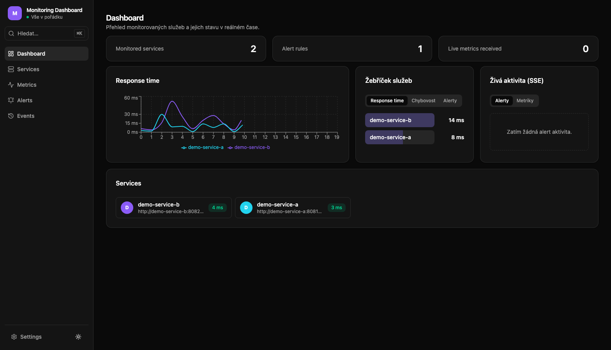
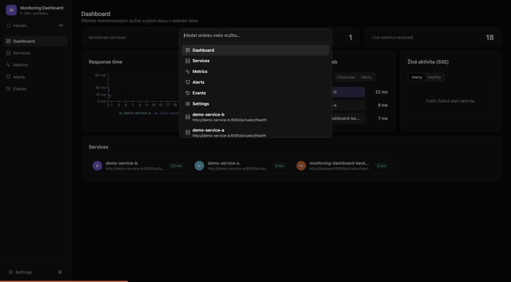
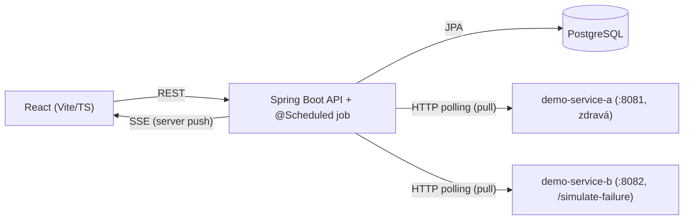

# Monitoring Dashboard

**Full-stack monitorovací platforma pro sledování infrastruktury v reálném čase** —
napsaná jako portfolio projekt demonstrující produkční přístup k Java/Spring Boot
backendu a React/TypeScript frontendu, ne jen "hello world" CRUD.

Aplikace hraje roli interního nástroje, jaký by týmy používaly ke sledování zdraví
svých služeb: registruješ službu (URL na health-check), dashboard ji začne aktivně
obcházet, sbírat její metriky a v reálném čase hlásit výpadky a překročené prahy.
V repu jsou i dvě malé "demo" služby, které monitoring skutečně obchází přes síť —
takže to, co vidíš, je opravdový monitoring loop, ne mockovaná data.



## Co umí

- **Sledování služeb** — registrace přes health-check URL, tagy, vyhledávání/filtrování,
  detail stránka s uptime % (počítané SQL agregátem) a historií.
- **7 typů metrik na službu** — health status, response time, CPU, paměť, volné místo
  na disku, počet requestů a chybovost. Grafy v čase i srovnání napříč službami.
- **Alert pravidla** — práh na libovolné metrice (>, <), vyhodnocování v reálném čase,
  historie TRIGGERED/RESOLVED, volitelné Slack/Discord webhook notifikace.
- **Živý dashboard** — Server-Sent Events tlačí nové metriky a alerty na frontend
  bez pollingu; žebříček služeb, kurovaná časová osa událostí, badge s počtem
  aktivních alertů v postranním panelu.
- **UX detaily, co dělají rozdíl** — Cmd+K command paleta, drag-and-drop editor
  alert prahů přímo v grafu, světlý/tmavý/systémový motiv, plně responsivní layout.
- **Nastavitelné branding** — název appky a barva motivu v Settings, uložené lokálně.



## Architektura



Backend pravidelně (pull model, viz [docs/architecture.md](docs/architecture.md))
obchází monitorované služby přes skutečnou síť — v repu jsou pro demo účely dvě
samostatné "hloupé" Spring Boot služby (`demo-services/`), aby monitoring
testoval reálnou HTTP komunikaci, ne interní volání. Backend ukládá metriky do
PostgreSQL, vyhodnocuje alert pravidla a nové stavy posílá na frontend přes SSE.
Frontend zbytek dat (historie, konfigurace) tahá klasicky přes REST.

## Tech stack

- **Spring Boot 3 / Java 21** — standard pro backend v Java ekosystému, dobrá
  podpora pro REST, JPA i SSE (`SseEmitter`) bez extra závislostí.
- **Gradle** — rychlejší a čitelnější build config než Maven pro tuhle velikost projektu.
- **PostgreSQL** — relační DB, hodí se pro strukturovaná data (services, alerty)
  i time-series metriky v menším rozsahu.
- **Flyway** — verzované DB migrace, žádné "magic" schema z Hibernate `ddl-auto`.
- **Server-Sent Events (ne WebSocket)** — tok dat je jednosměrný (server → klient),
  SSE je jednodušší infrastruktura a běží nad běžným HTTP/HTTP2.
- **React 19 + TypeScript + Vite** — rychlý dev feedback loop, typová bezpečnost
  na frontendu.
- **Tailwind CSS + shadcn/ui styl + Recharts** — konzistentní dark-mode UI a
  reálné grafy metrik v čase, ne jen textový výpis čísel.
- **Docker + docker-compose** — jednotné a reprodukovatelné lokální prostředí.

## Struktura projektu

Podrobný popis architektury a doménového modelu je v [docs/architecture.md](docs/architecture.md),
návrh REST/SSE API v [docs/api.md](docs/api.md). Stručně:

```
backend/         Spring Boot aplikace (REST API, SSE, scheduler, DB přístup)
demo-services/   dvě "hloupé" Spring Boot služby simulující monitorovanou infrastrukturu
frontend/        React + TypeScript dashboard
docs/            architektura, API design
```

## Lokální spuštění

```bash
cp .env.example .env
# doplnit DB_USER / DB_PASSWORD v .env
docker compose up --build postgres backend demo-service-a demo-service-b

cd frontend
cp .env.example .env   # výchozí VITE_API_BASE_URL sedí na docker-compose setup
npm install
npm run dev
```

Backend poběží na `:8080`, frontend (dev server) na `:5173`, PostgreSQL na `:5432`,
`demo-service-a` na `:8081` a `demo-service-b` na `:8082`. Obě demo služby se
zaregistrují samy (Flyway seed migrace) — po startu tedy stačí otevřít frontend,
nic ručně přes API zakládat netřeba. Frontend má i produkční Docker image
(`frontend/Dockerfile`, nginx), viz `docker-compose.yml`.

Živá API dokumentace (Swagger UI, generovaná z kódu): `http://localhost:8080/swagger-ui/index.html`.

## Stav projektu

Funkční aplikace, ne jen kostra — obě strany mají testy a prošly i ručním
end-to-end ověřením přes reálný běžící stack.

**Backend**
- CRUD pro služby a alert pravidla, scheduler sbírající 7 typů metrik
- Skutečné vyhodnocování alertů (TRIGGERED/RESOLVED) a kurovaná časová osa událostí
- Stránkované `GET /metrics` a `GET /events` (`PageResponse<T>`, volitelný filtr)
- Retention policy, co drží velikost metrik/eventů pod kontrolou
- Unit testy (Mockito) i integrační testy (Testcontainers, reálný PostgreSQL + Flyway)
- OpenAPI/Swagger UI generované přímo z kódu
- Volitelný API klíč (`X-API-Key`) na mutačních endpointech — bez nastaveného
  `API_KEY` je API otevřené (lokální/demo použití), `GET` je otevřené vždy
- Self-monitoring — backend sleduje i sám sebe stejnou cestou jako demo služby

**Frontend**
- Dashboard s grafem, žebříčkem služeb a živým feedem přes SSE
- Services a Alerts s formuláři, filtrováním a validací chyb z backendu
- Detail stránka služby (metriky, alerty, historie, uptime badge)
- Metrics stránka se srovnáním napříč službami, drag-and-drop editor alert prahů
- Cmd+K command paleta (s klávesnicovou navigací a a11y — focus trap, návrat focusu)
- Světlý/tmavý/systémový motiv, responsivní layout s mobilní navigací
- Vitest + React Testing Library testy na klíčovou logiku (formuláře, drag matematika, paleta)

**DevOps**
- Docker + docker-compose pro celý stack, produkční nginx image pro frontend
- CI pipeline (GitHub Actions): build+test backend, lint+test+build frontend
- Volitelné Slack/Discord webhook notifikace při alertu (`WEBHOOK_URL` env proměnná)
